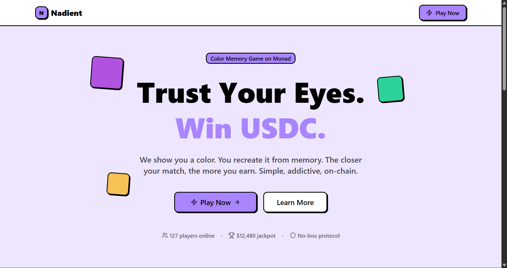

# Nadient

🔗 **Live Demo:** [nadient-game.vercel.app](https://nadient-game.vercel.app/)



---

## How to Play

1. **Connect your wallet** to Monad Testnet
2. **Claim free mUSDC** from the faucet (100 mUSDC / 24 hours)
3. Choose a game mode:
   - **Practice** — free play, no stakes
   - **Solo** — stake mUSDC against the color matching system
   - **Multiplayer** — create or join a room, play against friends (2–5 players)
4. Match the target color as accurately as possible within the time limit
5. Claim your winnings on the **Vault** page

### Payout Tiers (Solo Mode)

| Tier | Accuracy | Reward |
|------|----------|--------|
| JACKPOT | ≥ 98% | 10.0 mUSDC |
| GREAT | ≥ 90% | 7.5 mUSDC |
| GOOD | ≥ 75% | 6.0 mUSDC |
| MISS | < 75% | 0 mUSDC |

---

## Tech Stack

### Frontend
- **Next.js 16** + **React 19** (App Router)
- **Wagmi v3** + **Viem** — wallet & onchain interaction
- **Supabase** — database (leaderboard, match history)
- **Upstash Redis** — real-time room state & matchmaking
- **Tailwind CSS v4** + **shadcn/ui** — UI components

### Smart Contracts
- **Solidity 0.8.24** + **Foundry**
- **NadientGame.sol** — stake locking, ECDSA-verified round resolution, pull-pattern withdrawal, solo reserve pool
- **MockUSDC.sol** — ERC-20 test token with faucet

### Infrastructure
- **Monad Testnet** (Chain ID: 10143)
- **ECDSA backend signer** — verifies round results off-chain, then submits to the contract

---

## Architecture

```
┌─────────────────────────────────────────────────────┐
│                   Next.js App                       │
│                                                     │
│  ┌──────────┐  ┌──────────┐  ┌──────────────────┐  │
│  │  /play   │  │   /me    │  │     /vault       │  │
│  └──────────┘  └──────────┘  └──────────────────┘  │
│                                                     │
│  ┌─────────────────────────────────────────────┐   │
│  │              API Routes                      │   │
│  │  /rooms/*  /matchmaking/*  /play/*  /vault/* │   │
│  └──────────────────┬─────────────────────────── ┘  │
└─────────────────────┼───────────────────────────────┘
                      │
          ┌───────────┼───────────┐
          ▼           ▼           ▼
      Supabase    Upstash     Monad RPC
      (Postgres)  (Redis)   (via Viem)
                                  │
                                  ▼
                          NadientGame.sol
                          MockUSDC.sol
```

### Solo Mode Flow
1. Player stakes mUSDC → `depositStake()` on-chain
2. Server generates a `roundId` (bytes32)
3. Player submits their answer → server calculates accuracy
4. Backend signs the result → `resolveRound()` on-chain with ECDSA signature
5. Player claims balance via `withdraw()`

### Multiplayer Flow (Friend Room)
1. Leader creates a room with a 6-character code
2. Other players join via code or the shareable link `/play/lobby/[code]`
3. All players ready up & stake → room starts automatically
4. Round runs simultaneously for all players, results resolved on-chain
5. Winner claims from Vault

---

## Smart Contracts

| Contract | Address (Monad Testnet) |
|----------|------------------------|
| NadientGame | `0x5f2d05d60523ace45fAfaFD417f74C53de3D076A` |
| MockUSDC | `0x44FF2171847768800FE0CDB059aBe32E3F8d88eC` |

---

## Local Setup

### Prerequisites
- Node.js 20+
- Foundry (for smart contracts)
- Supabase account + Upstash Redis

### Frontend

```bash
cd fullstack
cp .env.example .env   # fill in all variables
npm install
npm run dev
```

### Environment Variables

```env
SIGNER_PRIVATE_KEY=              # backend signer private key
BACKEND_PRIVATE_KEY=             # backend operations private key
SUPABASE_SERVICE_ROLE_KEY=       # supabase service role key
NEXT_PUBLIC_SUPABASE_URL=        # supabase project URL
UPSTASH_REDIS_REST_URL=          # upstash redis URL
UPSTASH_REDIS_REST_TOKEN=        # upstash redis token
NEXT_PUBLIC_GAME_ADDRESS=        # NadientGame contract address
NEXT_PUBLIC_USDC_ADDRESS=        # MockUSDC contract address
NEXT_PUBLIC_CHAIN_ID=10143       # Monad Testnet
NEXT_PUBLIC_RPC_URL=https://testnet-rpc.monad.xyz
```

### Smart Contracts

```bash
cd sc
forge install
forge test
forge script script/Deploy.s.sol --rpc-url https://testnet-rpc.monad.xyz --broadcast
```

---

## License

MIT
